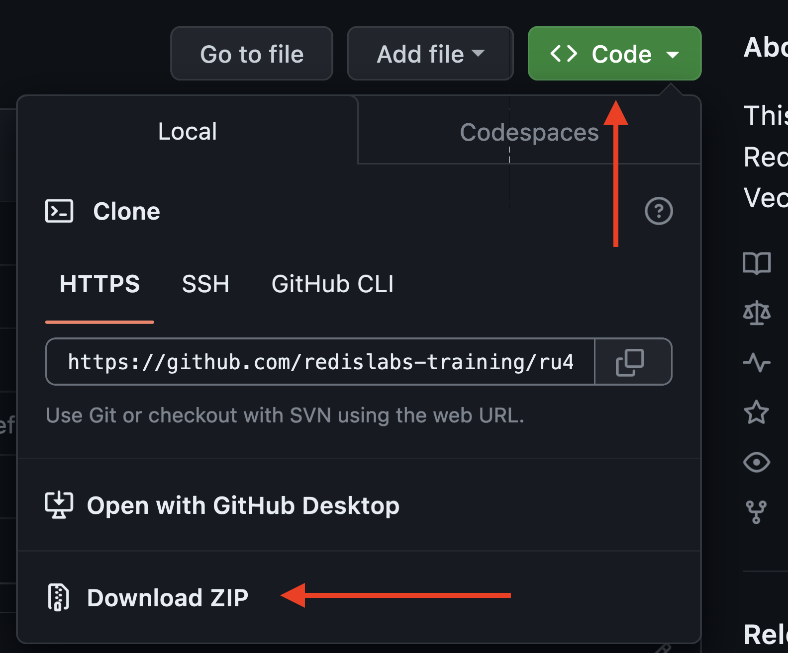

# RU402: Redis as a Vector Database


## Introduction

This repository contains example data and setup instructions for the Redis University course [RU402 Redis as a Vector Database](https://university.redis.com/courses/ru402/).

To take this course, you'll first need to do the following:

1. Make sure that you have Python 3.7 or newer installed on your system (we've tested this with Python 3.9).  Check your Python version with `python --version`.
1. Clone this git repository from GitHub.
1. Get a [Redis Stack](https://redis.io/docs/stack/) instance locally or in the cloud.
1. Install [RedisInsight](https://redis.com/redis-enterprise/redis-insight/).
1. Load the course sample data and create the search index.

We've provided detailed instructions for each of these steps below.

Throughout the course, we've provided example code written in Python, JavaScript (Node.js), Java and C#.  You don't need to run the code to be successful on this course, and the exam does not contain programming language specific questions.  If you'd like to try running some or all of the code samples then you'll also need to install:

* [Node.js](https://nodejs.org/) (version 14.8 or higher)
* [Java JDK](https://sdkman.io/) (Java 11 or higher)
* [.NET SDK](https://dotnet.microsoft.com/en-us/download/dotnet/6.0) (version 6 or higher)

## Clone the Course Git Repository

There are two ways to get a copy of this git repository on your machine...

### Option 1: Use git clone

If you have the [git command line tools](https://git-scm.com/downloads) installed, open up a terminal instance and clone the repository like this:

```bash
git clone https://github.com/redislabs-training/ru402.git
```

Now, change to the directory containing the course files:

```bash
cd ru402
```

The remainder of these instructions assume that you start from a terminal session whose current directory is `ru402`.

Your next step is to proceed to "Redis Setup".

### Option 2: Download a Zip File from GitHub

If you don't have the git command line tools, download the repository as a zip file from GitHub and unzip it on your local machine.



Now, open up a terminal instance and change to the directory containing the course files:

```bash
cd ru402
```

The remainder of these instructions assume that you start from a terminal session whose current directory is `ru402`.  

Your next step is to proceed to "Redis Setup".

## Redis Setup 

This course requires an instance of Redis Stack. Review the following options and choose the one that's right for you.

### Option 1: Redis Cloud

This option doesn't require you to install Redis on your local machine. We provide a free instance of Redis in the cloud that you can keep and use for your own projects once you're finished with the course.  

Let's get up and running with Redis in the cloud:

* Use your browser to navigate to the [signup page](https://redis.com/try-free?utm_medium=referral&utm_source=redisUniversity&utm_campaign=ru204) on redis.com.
* Complete the signup form and click the "Get Started" button.  Note that you can sign up with your Google or GitHub account if you prefer.
* When you receive the activation email from Redis, open it and click on the "Activate Account" button.
* You'll be taken to the dashboard, and a New Subscription dialog appears:


* Select your preferred cloud provider and a region close to you. This is where we'll host your free Redis instance for you.
* Click the "Let's start free" button.
* Your new free database will be created, and you should see something like this:


* Click on "Redis-free-db" to drill down into the details for your instance.
* To set up RedisInsight and connect the course data loader script to your database, you'll need to gather the following items from the dashboard and keep a record of them:
  * Host name
  * Port
  * User name (this will be `default`)
  * Password
* Your host name and port can be found in the "General" section (see below for example, here the host name is `redis-15676.c10.us-east-1-3.ec2.cloud.redislabs.com` and the port is `15676`).


* Scroll down to the "Security" section.
* Click the "Copy" button next to "Default user password" to copy the Redis password into the clipboard.  Paste this somewhere for safekeeping.  Alternatively, click the eye icon to show the password:


* If you see a green check mark next to the "Redis-free-db" title, your database is ready to use!


### Option 2: Docker

This is the most straightforward option if you want to run Redis locally.  First, make sure you have [Docker installed](https://docs.docker.com/get-docker/).

This course uses the Redis Stack Docker container.  Download and start it with as follows:

```bash
docker run -d --name redis-stack -p 6379:6379 -p 8001:8001 -e REDIS_ARGS="--requirepass mypassword" redis/redis-stack:latest
```

Check that the container is running like this:

```bash
docker ps
```

You should see output that includes the following:

```
CONTAINER ID   IMAGE                        COMMAND            CREATED        STATUS       PORTS                                            NAMES
3309f829b90a   redis/redis-stack:7.2.0-v0   "/entrypoint.sh"   2 months ago   Up 7 weeks   0.0.0.0:6379->6379/tcp, 0.0.0.0:8001->8001/tcp   redis-stack
```


### Option 3: Install Redis Stack 

Redis Stack can be installed using popular package managers for macOS and Linux.  [Follow the instructions on redis.io](https://redis.io/docs/stack/get-started/install/) to install and start Redis Stack.


## RedisInsight Setup

RedisInsight is a graphical interface allowing you to interact with data and configure Redis instances.

### Option 1: Install and Configure the Desktop Application

The preferred way to run RedisInsight is as a desktop application.  If you're using a Redis instance in the cloud, you'll need to install the RedisInsight desktop application.  If you chose the Docker or local install of Redis Stack option for your Redis instance, you can either install the RedisInsight desktop application or choose run it as a web application with no further software installation required (see option 2 below).

To use the desktop application, first download and install it using the instructions on the [RedisInsight download page](https://redis.com/redis-enterprise/redis-insight/).  

Once you have installed RedisInsight, start it up and agree to the terms and conditions of use. 

Finally, configure RedisInsight to connect to your Redis Instance... Click the "ADD REDIS DATABASE" button and fill out the new database form with the following values.

If your Redis instance is in the cloud:

* **Host:** The host name for your cloud database
* **Port:** The port number for your cloud database
* **Database Alias:** RU204
* **Username:** default
* **Password:** The password for your cloud database
* **Select Logical Database:** [leave unchecked]
* **Use TLS:** [leave unchecked]

If you are using Docker or you have installed Redis Stack locally:

* **Host:** localhost
* **Port:** 6379
* **Database Alias:** RU204
* **Username:** [leave blank]
* **Password:** [leave blank]
* **Select Logical Database:** [leave unchecked]
* **Use TLS:** [leave unchecked]

Then click the "Add Redis Database" button to connect to your Redis instance.  You should see "RU204" in the list of Redis databases, and can click on it to open the Browser view.


If you see an error while trying to connect to Redis, ensure that your Redis instance is running (make sure the Docker container is up or your locally installed Redis Stack is running) and try again.

Your next step is to load the sample data...

### Option 2: Use the Web Interface

If you used the Docker or local install of Redis Stack options to get your Redis instance, you can choose to use RedisInsight as a web application with no further software to install.  If you're using a Redis instance in the cloud, this option is not currently available to you, and you should download and install RedisInsight instead.

First, ensure that the Docker container or your local Redis Stack installation is running.

Now, point your browser at `http://localhost:8001/` and you should see the RedisInsight terms and conditions:


Accept the terms and click "Submit".  RedisInsight will automatically connect to the local Redis Stack instance and display the key browser:


Your next step is to load the sample data..

## You're Ready!

You're now ready to take the course!  If you haven't already, [sign up here](https://university.redis.com/courses/ru402/) to access the course materials.

## You're Not Alone!

> TODO

If you need help or want to chat about all things Redis, [join us on our Discord server](https://discord.gg/46upnugY5B) where you'll find a dedicated channel `#ru204-storing-querying-and-indexing-json-at-speed` for this course.